# Arduino Micro Arcade

This project involves using the Arduino micro-controller link two sensors to an LED screen, so that you can play [Space Invaders](http://en.wikipedia.org/wiki/Space_Invaders). The goal of this project is for you to:

* Gain experience working with hardware, including circuits and a little bit of soldering (soldering is not required for the core, but you may need to solder for your reach depending on the hardware you add).
* Understand the basics of how software can control hardware, both input (a potentiometer and a button) and output (an LED screen)
* Solidify the concepts you've learned in EECS 183, including functions, branches, loops, arrays, and classes
* Use these concepts in a comprehensive project
* Start moving beyond simply writing code to designing programs
* Have fun!
* **NOTE!!!**: This project will be limited to the first 45 teams to request this project. Your team MUST submit a request using the [Arduino Team Sign-Up form](http://goo.gl/forms/DAWJBoLh79) by 11:59 pm on March 24th. **Only one sign up per team please**. Also note that, should the limit of 45 teams be reached before this time, the sign up form will close and your team will not be able to select this project. More details are found in the [Proposal](#proposal) section of this document.

Here's a picture of what your final product might look like:

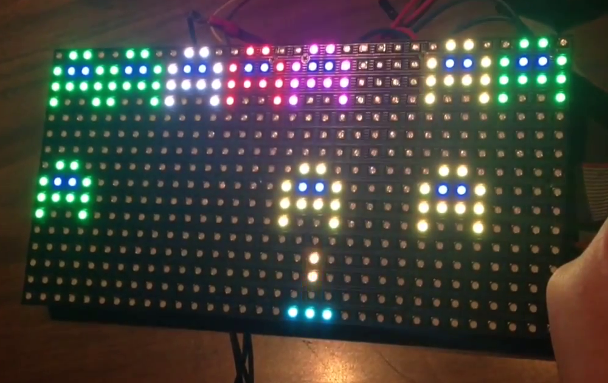

## Table of Contents

* [Core](#core)
    * [Hardware Overview](#hardware-overview)
        * [The Arduino](#the-arduino)
        * [The Breadboard](#the-breadboard)
        * [The Inputs](#the-inputs)
        * [The Output](#the-output)
    * [Software Overview](#software-overview)
        * [Space Invaders](#space-invaders)
        * [Graphics](#graphics)
        * [Game Dynamics](#game-dynamics)
* [Getting Started](#getting-started)
    * [Hardware](#hardware)
    * [Software](#software)
    * [Distribution Code](#distribution-code)
* [Hints](#hints)
* [Reach](#reach)
* [Proposal](#proposal)
* [Submission](#submission)
* [Grading](#grading)
* [Troubleshooting](#troubleshooting)
* [Support Staff](#support-staff)
* [References](#references)

# Core

The core part of this project is for you to implement a clone of Space Invaders, an early arcade game and a key part of video game history. We chose this game so that it is approachable for beginning programmers and game developers while fitting the micro Arcade platform well.

## Hardware Overview

**NOTE**: At the end of the showcase, you **MUST** return all components that you have checked out from the class. **_If any component is broken, or if it is not returned at the end of the showcase, you must pay to replace that component._** You will not receive your grades for the semester until you have paid.

Your team will be provided with the following necessary hardware

* 1 Arduino Uno
* 1 Adafruit 16x32 RGB Matrix Panel
* 1 breadboard
* 1 potentiometer
* 1 button
* 1 Piezo speaker
* 1 flat ribbon cable
* 1 USB cable
* 1 5V power converter
* wires
* 3 1K resistors
* 1 box

### The Arduino

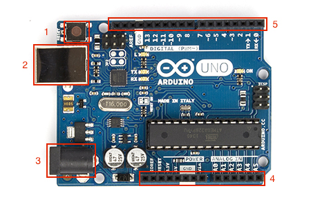

The Arduino is a single-board microcontroller, essentially a tiny computing platform for creating interactive projects. The Arduino language is based on C/C++ and is very easy to learn. Libraries are available for all types of displays you will use, and I/O in general is easy to program. Arduino uses its own IDE, and you are expected to use it. You can download it at [the Arduino website](http://arduino.cc/en/Main/Software).

If you orient your Arduino to match the picture above, you can see the main components of the Arduino you will be using. Going counter-clockwise from the top left:

1. On the top left corner, there's a button that restarts the Arduino.
2. Just below that button is a USB port, that allows you to upload code to the Arduino.
3. On the bottom left corner, there's 5V power connector. You won't need to use this, as we will be powering the Arduino by USB.
4. Along the lower edge are a series of *pins*, which connect the Arduino to inputs and outputs. If you look closely, you will see that some pins provide power, while others get *analog* input (like the potentiometer) and output (like telling the LED screen which rows to light up)
5. Along the upper edge, there's another series of pins. These handle *digital* input (like the button) and output (like the color of the LEDs).

### The Breadboard

The way you will connect the Arduino to its inputs and outputs with through a *breadboard*. They look like this:

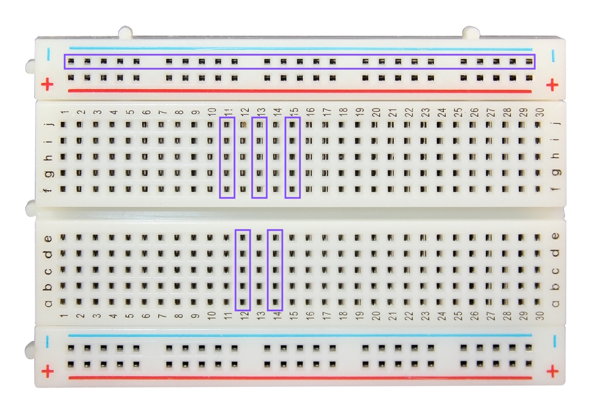

Breadboards let you create circuits by providing an easy way to wire things together. Inside the breadboard, there's a piece of metal that connects every numbered row, so all wires plugged into that row would share the same voltage/signal. Additionally, the column of holes on the side also share a connection. The colored lines indicate that these holes are usually used for power and ground (red for power, blue for ground) - any electronic circuit needs to have some connection between power and ground to work. For example, in the picture above, all the holes inside a purple rectangle share a connection. For this project, we will mostly be using the power and ground holes on the breadboard.

### The Inputs

There will be two inputs to your game: a potentiometer and a button. A button is really just a switch - when you press the button, it completes a circuit and changes the voltage, which is how the Arduino knows you pressed the button. For the curious, electrically, it looks like this:

A potentiometer is a much more complicated piece of hardware than a button. If you want to find out more, take a look at [the Wikipedia article](http://en.wikipedia.org/wiki/Potentiometer).

### The Output

We are using the Adafruit 32x16 LED screen. The front of it looks like this (when it's lit up):

Each of those bright, little dots is an LED (Light Emitting Diode). We can separately set the amount of red, green, and blue light that comes out of each one. If they're all on, the LED will be white, and if they're all off the LED will be black.

On the back, there are three main connectors. Make sure the board says "IN" or "INPUT" and "OUT" or "OUTPUT" near the correct connectors:

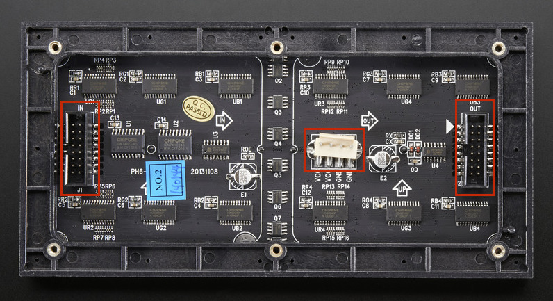

* On the left is the input connector. We will be connecting this to the Arduino via the breadboard, some wires, and a flat ribbon cable.
* In the middle is the power connector. We will be connecting this to the power converter.
* On the right is the output connector. We will not be using this connector in this project.

## Software Overview

Your team will be provided with the following necessary software:

* A starter sketch file including the minimal set of functions necessary for the Core project.
* Two libraries for using the LED screen.

Additionally, you will need to install:

* The Arduino IDE

### Space Invaders

The goal of this game is to kill all invaders by shooting them, before they can move past you or kill you in turn. You will control a cannon through a potentiometer and a button; the potentiometer controls where you cannon points, while the button fires the cannon.

Every game begins the same way:

1. Before the game starts, display "Lives: `<number of lives>`".
2. Before a level starts, display "Level: `<level number>`".
3. The invaders are then *array*-ed on the top of the screen; the game begins.
    * If an invader's strength is reduced to 0, it dies and disappears from the screen.
    * If an invader touches the player's cannon, the player dies (and loses a life).
    * If an invader reaches the bottom of the board, the player loses a life.
    * If all invaders are killed, the next level is loaded.
4. The game continues until the player has died three times. Display "Game Over" when this happens.

The initial layout and the strength of the invaders depends on the level. All levels have at most 16 invaders, laid out in two rows of 8.

* On Level 1, only 8 invaders are present on the top of row, all with strength 1:

        1 1 1 1 1 1 1 1

* On Level 2, 16 invaders are present in two rows, with strengths specified as follows:

        1 2 1 2 1 2 1 2
        2 1 2 1 2 1 2 1

* On Level 3, 16 invaders are present in two rows, with strengths specified as follows:

        1 2 3 4 5 1 2 3
        4 5 1 2 3 4 5 1

* On Level 4, 16 invaders are present in two rows, with strengths specified as follows:

        5 4 5 4 5 4 5 4
        2 3 2 3 2 3 2 3

* On Level 5 and after, the 16 invaders will have randomly chosen strengths. This means level 5 and every level onwards should be different every time it is played (levels should be different every time we play them, do NOT create a set of levels to cycle through).

### Graphics

The player's cannon is drawn as four LEDs, 3 on the bottom and one on top in the middle. The player is always aquamarine in color.

     *
    ***

The invaders are drawn with 12 LEDs each:

     ## 
    #**#
    ####
    #  #

The LEDs marked with # change in color depending on the strength of the invader, while the LEDs marked with * are always blue. The invaders are colored roughly according to a rainbow:

* Strength 1: red
* Strength 2: orange
* Strength 3: yellow
* Strength 4: green
* Strength 5: blue
* Strength 6: purple
* Strength 7: white

Finally, the cannonball fired by the player takes two LEDs, vertically on top of each other. It is always orange.

    *
    *

### Game Dynamics

The player is controlled by the potentiometer, and when the button is pressed, a cannonball should shoot out from the top middle LED. The cannon should be able to shoot from any column of the board; this means that the base of your cannon should be able to move one pixel off the edge of the screen, with the barrel appearing on the edge. When you shoot, the shot should be visible until you reach a creature or until it moves off of the top of the board. Both the cannonball and the invader should disappear if the ball would move on top of the invader. Finally the bottom row of invaders should move down by one LED every few seconds. Only once the bottom row of invaders is completely destroyed, the top row of invaders should start moving down. If an invader overlaps with the player, then the player loses a life. The game continues until the player has lost all three lives. It is up to you what you want to do after displaying "Game Over". You can either restart the game or keep displaying "Game Over".

Given this description, the key part of your code will need to do the following:

    * Update the position of the player based on the value of the potentiometer
    * Update the position of the cannonball, including detecting if a new cannonball is being fired
    * Update the position of each invader
    * Detect if the cannonball is colliding with any of the invaders; if so, both the cannonball and the invader disappear
    * Detect if the player is colliding with any of the invaders; if so, the player loses a life and the level restarts
    * Detect if all the invaders are killed; if so, start the next level

# Getting Started

Here is a short guide to help you start this project. This guide walks you through wiring the potentiometer, the button, and the LED screen, as well as getting your computer set up to start programming the Arduino.

## Hardware

**WARNING: DO NOT power your Arduino or LED Matrix unless you are sure everything is wired properly**. Improperly wired projects may cause damage to your board or components. **_If you break a component, you will be responsible for replacing it!_**

There are two parts to setting up your hardware: wiring the button and the potentiometer to the Arduino as inputs and wiring the LED screen to the Arduino as an input.

### The Inputs: Potentiometer and Button

Attach the potentiometer onto a column on the breadboard so that all the legs are in the same column. Looking at the image below, the leftmost leg is connected to ground. For this project, you should connect the middle leg to analog pin 5 even though in the image it is connected to analog pin 3. The rightmost leg should be connected to power.

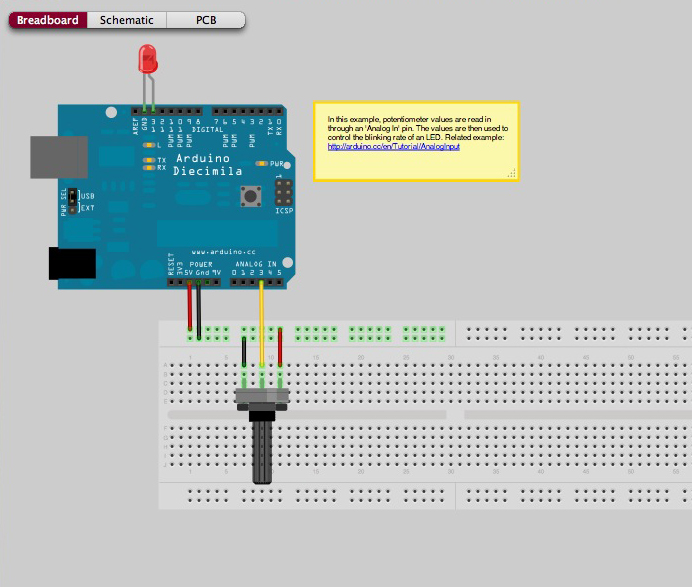

For the button, you want to position it on your breadboard so that the legs on opposite sides of the button spans a ditch (as shown in the digram). One leg should be wired to power; the other leg should be connected to the resistor(in the range of 1 kohm to 10 kohm) and digital pin 10. The resistor should be connected to ground. This image shows the correct wiring for a button connected to digital pin 2 (instead of pin 10).

### The Outputs: The LED Screen

1. Make sure that neither the Arduino nor the LED screen is connected to a power source - that is, neither to a USB cable, nor to a power converter.

2. Each pin on the Arduino is labeled - the digital pins go from pin 0 up to pin 13, the analog pins go from A0 to A5, as well as power pins marked GND (for ground) and 5V (5 volts). We will refer to these as pin 0, pin 1, ... pin 13, pin A0, pin A1, ... pin A5, and simply ground and power for GND and 5V.

3. The pins on the input connector of the LED screen are also labeled. The border of the board may obscure some of the labels, so we've recreated the diagram here:

    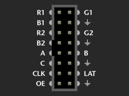

    Here is (roughly) what the different pins do:
    * The symbol that [looks like a downward arrow](http://en.wikipedia.org/wiki/Ground_%28electricity%29#Electronics) stands for ground.
    * The R1, G1, B1, R2, G2, B2 pins tell the screen what red, green, and blue values to display on the upper and lower half of the board respectively.
    * The CLK (clock) pin tells the screen that new data has come in.
    * The A, B, and C pins tell the screen which row is currently being described.
    * The LAT (latch) pin tells the screen that it's the end of the current set of data.
    * The OE (output enable) pin tells the screen to move to the next row of LEDs.

4. On your ribbon cable, take a look at the connectors - one side of each connector has a bump, which fits into the corresponding gap in the Arduino input connector. If you lay the cable flat, then the pins on the two ends of the cable correspond like this:

    

5. Plug one end of your ribbon cable into the input connector in your LED screen, then flip the screen back over and lay everything flat again. Because the LED screen is now flipped from when you were reading the pin labels, the pins are also flipped. That is, for the unplugged end of the cable, the corresponding labels would be(NOTE: MAKE SURE THE RED STRIPE IS AT THE TOP LIKE IN THE BELOW IMAGE):

    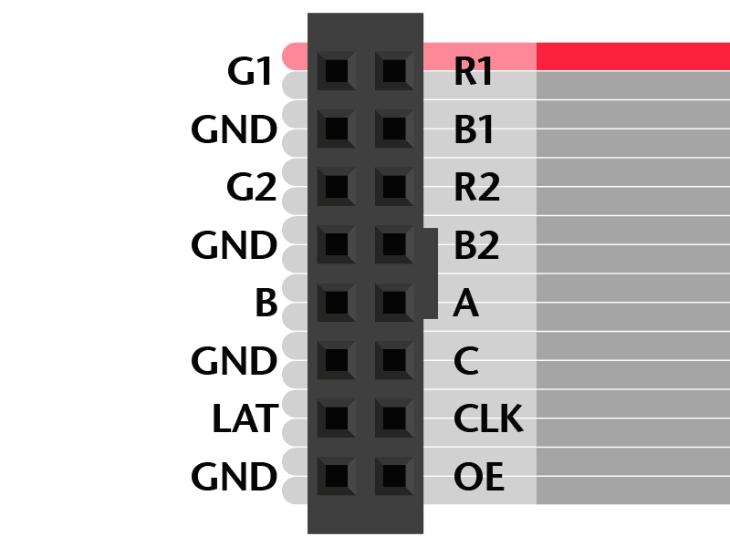

6. Just one more thing before we begin wiring. By convention, different colored wires are used for different things, so that it's easier to separate them. The most common convention is to use red wires for power, and black wires for ground. In this project, we will also be using wires that represent the red, green, and blue values of LEDs. If you don't have wires of these colors, don't worry - you can still do the project, you'll just have to keep track of the different wires more carefully.

7. Now we're ready to start wiring. First, four of the input connector pins should be grounded (i.e., connected to ground). Since we only have three ground pins on the Arduino, we will need to use the breadboard. Take a wire - preferably black - and gently insert it into one of the ground pins on the Arduino. Take the other end and insert it into a hole on the breadboard next to one of the blue lines.

8. All the GND pins on the cable should be wired to other holes next to the same blue line. This connects those pins to the breadboard, which connects to ground on the Arduino.

9. The remaining wires go directly between the Arduino and the cable. The wirings, Arduino -> cable, are listed below. Make sure you do each one correctly; once everything is wired, it becomes much more difficult to check that a wire is connecting the right pins. The pin labels are included again for easy reference.

    * 2 -> R1
    * 3 -> G1
    * 4 -> B1
    * 5 -> R2
    * 6 -> G2
    * 7 -> B2
    * 8 -> CLK
    * 9 -> OE
    * A0 -> A
    * A1 -> B
    * A2 -> C
    * A3 -> LAT

    

10. Double check that everything is wired correctly. There should be one (1) wire between the Arduino and the breadboard, four (4) wires between the breadboard and the LED screen, and twelve (12) wires between the Arduino and the LED screen. (You will have more if you've wired the potentiometer and/or the button.)

11. Connect the Arduino to your computer with the USB cable.

12. Connect the LED screen to the power converter, and plug the power converter into a wall socket.

13. Wait for one minute, keeping an eye on the Arduino. The LEDs may remain off, or they may flicker depending on what is currently stored in the Arduino. Gently touch the chip on the Arduino (the large black rectangle in the middle), and make sure that it is not getting hot. **If the Arduino gets hot, immediately unplug both the Arduino from your computer and the power converter from the wall socket.** You probably wired your screen incorrect if this happens, and will need to check all your wires.

14. If after a minute everything still looks fine - no smoke, the Arduino is at room temperature - then your Arduino is ready to be programed!

15. You know you wired everything correctly if you run the plasma sample and it looks like this: https://www.youtube.com/watch?v=C_9GDqs-zDY

## Software

**WARNING: DO NOT start coding until you have wired your matrix properly and can test while you code.**

1. Download your team's repository distribution code from Github by issuing this command on the terminal to clone your team's repository:

    `git clone https://github.com/eecs183/Arduino_<###>_repository.git`
    
    where `<###>` is the number of your group's repository. **Be sure to clone your group's repository, NOT that of the micro-arcade-W16 specification!**

2. [Download the Arduino IDE](http://arduino.cc/en/Main/Software). Although there are Xcode and Visual Studio plugins for Arduino, the staff will **not** support them.

3. Install and/or run the Arduino IDE. Follow any directions as necessary; in particular, on Macs, you may be asked to install a newer version of Java. Successfully starting the IDE should give you a window like this:

    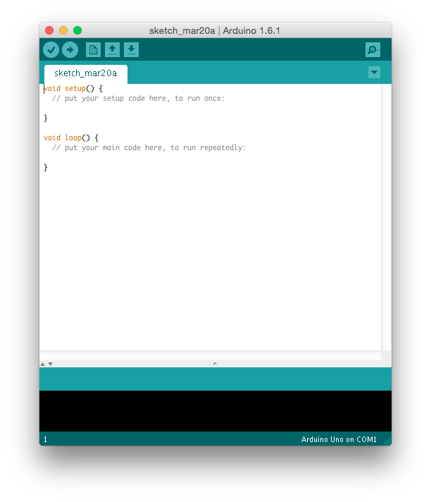

4. Make sure that from the menubar, Tools > Board > Arduino Uno is selcted.

    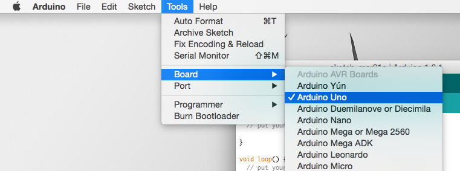

5. Make sure that from the menubar, Tools > Port > Arduino Uno is selcted.

    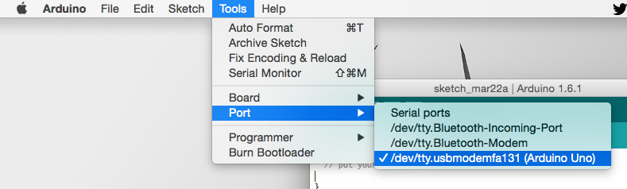

6. From the menubar, click Sketch > Import Library > Add Library (it may also be Sketch -> Include Library -> Add .ZIP library):

    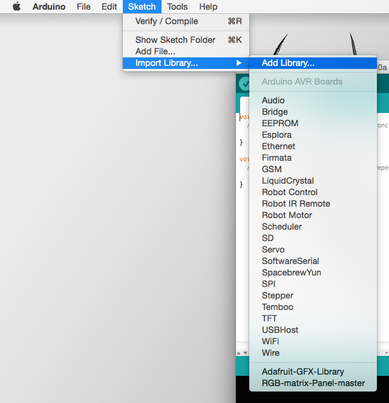

7. In the dialog, select the Adafruit GFX library (the adafruit-gfx directory in your Git directory).

    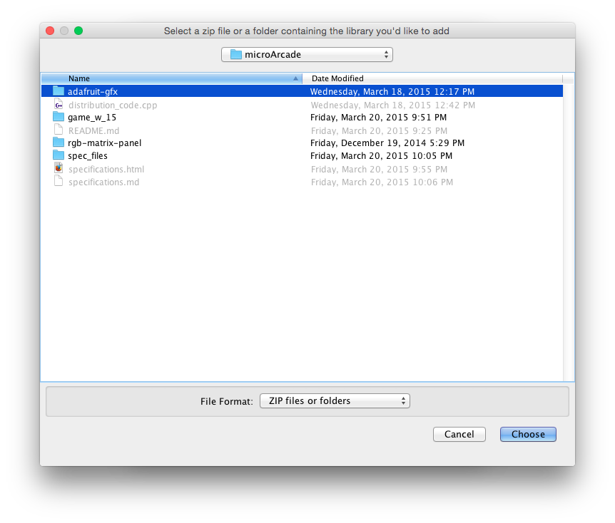

8. Repeat steps 6 and 7 with the RGB Matrix Panel library (the rgb-master-panel directory in your Git directory)

    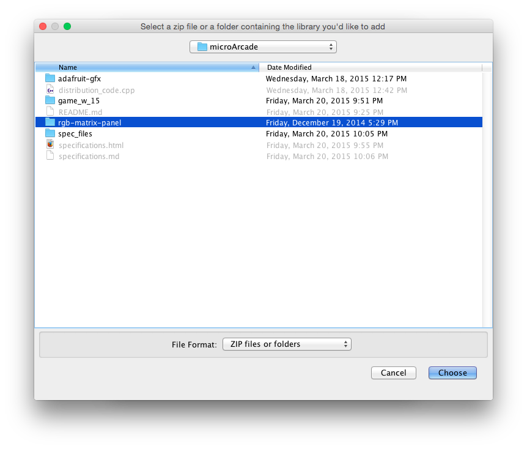

9. Open the distribution code, cloned from your group repository in Step 1 above, from the menu. Alternately, you can open the distribution code from the Open button (the up-arrow) near the top of the IDE.

    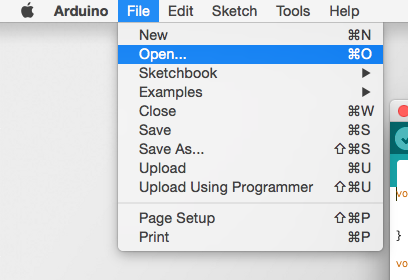
    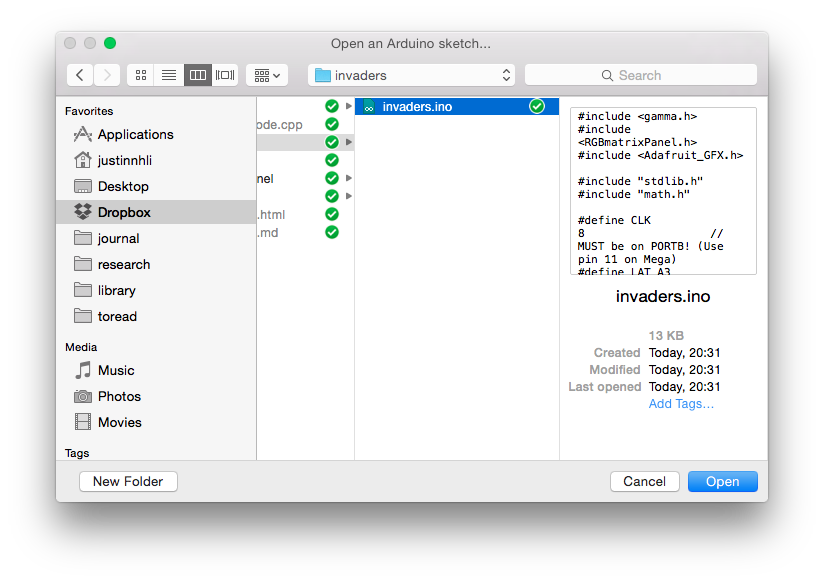

10. Click the Verify button (the checkmark) near the top of the Arduino IDE. This compiles your code and checks for errors. If you get an "Error Compiling" message, make sure you have added the libraries correct (steps 6 - 8). A successful compilation looks like this:

    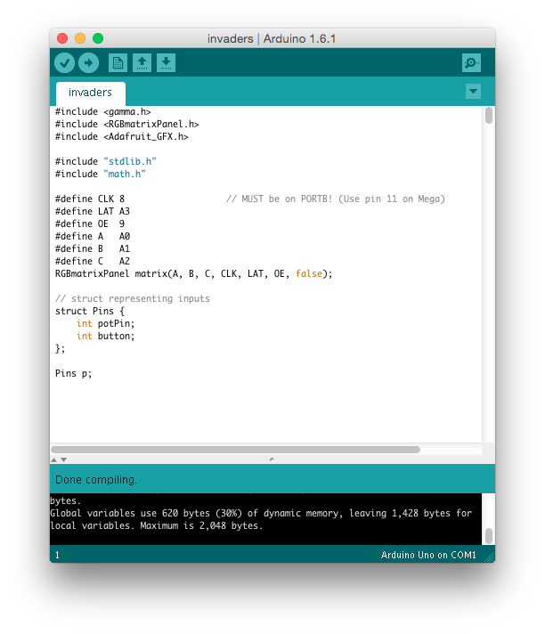

11. Congratulations! You are now ready to start programming your Arduino! Start by playing with the Arduino by looking at the examples under the `rgb-matrix-panel` directory. When you get a feel for how the functions work, it's time to start thinking about how you would write your Space Invader clone.

## Distribution Code

All the code that you write for this project will be in the single distribution file. This includes not only the code for drawing the invaders and the player cannon, but also the code that determines whether the player has won or lost. The Arduino framework relies on two functions:

* setup() - This function is called at the very beginning when the Arduino starts. Any initialization code - including setting the Arduino to properly read from the potentiometer and the button, and to properly output to the LED screen - should be done in this function.
* loop() - This function is called repeatedly as the Arduino runs. This is where you will implement most of the game logic.

For convenience, we have outlined several classes for you. *You are not required to use these classes*, but they may help you get started. We have also given you several function headers. You are not required to use our functions if you don't want to. You can create your own. 

* The `Color` class (not to be confused with `COLOR` below) is a wrapper around  `Color333()`, so you don't have to deal with RGB values directly. Several `const Color`s have already been defined for you, although of course you are welcome to define more colors. To use in the `matrix` functions, use `Color::to_333()`, eg. `matrix.drawPixel(1, 1, GREEN.to_333());`.
* The `Invader` class represents an invader.
* The `Cannonball` class represents the cannonball.
* The `Player` class represents the player cannon.
* The `Game` class pulls everything together, and handles the logic of winning and losing, as well as the drawing of each game element.

The Arduino, Adafruit GFX, and RGB Matrix Panel libraries also provide several functions you may use. Some functions you may find useful include:

* `delay(int t)` stops the execution of your program for `t` milliseconds.
* `millis()` returns the number of milliseconds since your program started.
* `pinMode(int pin, MODE)` sets the argument `pin` to take digital input - like a button. For this project, `MODE` should always be `INPUT`.
* `digitalRead(int pin)` takes a `pin` (like the one passed to `pinMode()`) and returns either `HIGH` or `LOW`. For a button, this corresponds to the button being pressed and not being pressed respectively.
* `analogRead(int pin)` reads the value of the argument `pin` and returns its value. This is used for analog inputs - like the potentiometer.

These functions, and many others, are all documented [on the Arduino website](http://arduino.cc/en/Reference/HomePage).

In addition to Arduino functions, the Adafruit screen also has functions you can use. We have defined a global variable called `matrix`, which is how you control the LED screen. It has several member functions:

* `begin()` initializes the screen
* `Color333(int r, int g, int b)` returns a `COLOR` where the `int` arguments are the red, green, and blue aspects of a color in [the RGB model](http://en.wikipedia.org/wiki/RGB_color_model) In this case, the arguments `r`, `g`, and `b` must be between 0 and 7 inclusive.
* `drawPixel(int x, int y, COLOR)` turns the pixel at (x, y) into the specified color. Since the screen is 32 LEDs wide by 16 LEDs high, this function requires `0 <= x < 32` and `0 <= y < 16`. If `COLOR` is black (ie. `r == g == b == 0`), then the LED is turned off.
* `fillScreen(COLOR)` turns every pixel of the screen to the specified `COLOR`.
* `print(char c)` switches the LEDs on screen to display the character `c`. The effects of this function is modified by several other functions; see below.
* `setCursor(int x, int y)` moves the "cursor" of the screen to the (x, y) location. This changes the effect of `print()`.
* `setTextColor(COLOR)` sets the color of printed text to `COLOR`. This changes the effect of `print()`.
* `setTextSize(int size)` sets the size printed text. A `size` of 1 means the text will be 8 LEDs tall. This changes the effect of `print()`.

For everywhere that we used `COLOR` above, we refer to the output of the function `Color333()`. You can learn more about the Adafruit libraries by looking at the `.h` files included with the distribution code.

Finally, you can use the `Serial.print(string text)` and `Serial.println(string test)` functions for debugging. This prints `text` to the Arduino IDE, much like ``cout`` prints to the console in Xcode or Visual Studios. `Serial.print()` does not insert an `endl`, while `Serial.println()` does. You can open the Serial monitor by clicking the top right of the Arduino IDE:

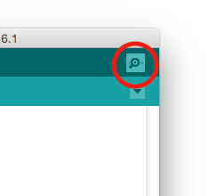

Be careful! If you use either function too many times in your code, your code could slow to a crawl.

# Reach
You may NOT implement pong or block breaker. If you want to implement snake, make it your own creative original version of snake. We don't want to see classic snake.

Your reach must be complex enough if you want full points. Simply implementing powerups or a boss level is not sufficient unless you go above and beyond in your execution of this. 

We are most impressed by students being creative and implementing their own games. Seeing the same game over and over again is boring. Try to be unique. We don't want to see 20 implementations of snake.

From the basic use of the Arduino microcontroller, there are many extensions for this project. Here is a short list meant to inspire your team. The list of possible extensions to this project is limited only by your imagination:

* Adding sound to your games and an LCD display for a scoreboard would be nice and is something you should look into, but this would not be a complete extension considering how simple it is. You would have to couple it with a few more ideas. 
* Program an additional game of your own creation
* Change the rules of the current game so that it has a more difficult implementation.
* Write an AI that could reliably beat the game. The AI must be intelligent.

# Proposal

## Step 0 of 2

**NOTE!!!**: This project will be limited to the first 45 teams to request this project. Your team MUST submit a request using the [Arduino Team Sign-Up form](http://goo.gl/forms/DAWJBoLh79) by 11:59 pm on March 24th. **Only one sign up per team, please**. Failure to do so will disqualify your team from selecting this project. Also note that if the limit of 45 teams is reached, no futher teams will be allowed to complete this project. Form your team early and complete the [Arduino Team Sign-Up form](http://goo.gl/forms/DAWJBoLh79)! Then your team may complete and submit your proposal, as detailed below.

## Step 1 of 2

The team that you submit your proposal with constitutes your team for the Final Project. There will be no revisions to these teams except in situations which merit staff intervention. You may not change your team once this document has been submitted.

Create a PDF file called proposal.pdf. Include the following:
* The name of your team.
* Name, uniqname, and GitHub username for each team member.

Your proposal **must** also answer the following questions about your team:

* How will your team split up the work?
* How regularly will your team meet to work on this project, if at all?
* What are two possible ideas for the reach that you are considering?

As well as these warm-up questions about the project:

* By convention, different colored wires often have different meanings. What do red wires and black wires usually stand for?
* In the [overview for the distribution code](#distribution-code), we mention that `matrix` has member functions. How would you call the `fillScreen()` function of `matrix`?
* The LED screen starts with (0, 0) at the top left corner, and has 16 rows and 32 columns. What is the (x, y) of the bottom right corner? How would you [turn that pixel `RED`](#distribution-code)?
* There are at most 16 `Invaders` on screen. What is a good way of storing these Invaders? What programming concept could you use to draw all of them?

## Step 2 of 2

Only one person per team needs to complete the following instructions.
Submit your proposals in PDF format by **Sat 3/26** to [EECS 183 on Gradescope](https://gradescope.com/courses/2688).

* Head to [EECS 183 on Gradescope](https://gradescope.com/courses/2688). Then choose **Proposal: Arduino** from the assignments list. Select **Submit PDF** and upload your proposal.pdf.
* Once the PDF file has been uploaded, select pages corresponding to each part (i.e., question) of the proposal assignment. Click **Save**.
* Click on **Add Group Member** on the top right. Add the three other members of your team by typing their names or email addresses. Once everyone on your team is in the list, click **Save**. Everyone who has been added to the group on Gradescope will receive an email and will be able to access the submission, including the score and staff's comments after the proposal has been graded.

# Project Submission

Submissions will occur via your team GitHub repository. You will create a sketch file starting from the distribution code. Your entire implementation will be in this one file. We will retrieve your file from your group repository on the due date. We are not grading the functions separately. We will run your game on a board and make sure everything that is specified happens correctly or points will be deducted. Do not just write your code without continuously testing it on the board. It will be exceptionally hard to debug that way.

# Grading Point Distribution and Dates

| Project Component   | Maximum Points | Due Date | How to Submit |
|:-------------------:|:--------------:|:--------:|:-------------:|
|Proposal             |      10         |  3/25   | Gradescope |
|Core Team Evaluation |      5         |    4/8   |TBD        |
|Core                 |      45        |    4/8   |GitHub         |
|Style                 |      5        |    4/8   |GitHub         |
|Reach                |      50        |     4/18    |GitHub         |
|Final Team Evaluation|      5         |     4/19    |TBD        |
|Showcase             |      10        |    4/21     |Attendance + Presentation     |

# Troubleshooting

If the Arduino IDE refuses to run on a Mac, even after you have installed a newer version of Java, you may need to download the experimental version. Go back to [the Arduino website](http://arduino.cc/en/Main/Software), download the experimental version (the one marked "for Java 7+"), and try again. If this still doesn't work, come talk to one of us.

# Support Staff

The Arduino Micro Arcade staff team has the following staff members.

* Anna Rode
* Anna Wasewicz
* Bill Arthur
* Diana Slaba
* Pranav Srinivasan

# References

* The [Adafruit GFX library](https://github.com/adafruit/Adafruit-GFX-Library/commit/a9e5bc470736ffe9c9ef11d778bc4dcd47169d42)
* The [Adafruit RGB Matrix Panel library](https://github.com/adafruit/RGB-matrix-Panel/commit/8570b7a431ff0ac52ff16b8448926cd0913dd609)
* The [instructions for wiring the RGB Matrix](https://learn.adafruit.com/32x16-32x32-rgb-led-matrix/overview)
